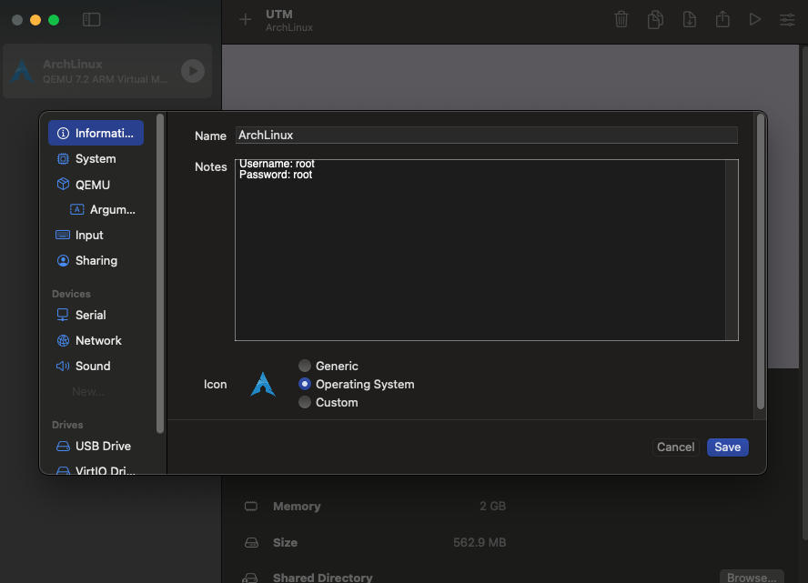

# Instalación de Linux en Máquina Virtual con Mac ARM (M1, M2, M3, M4 y variantes)

En este tutorial instalaremos paso a paso Ubuntu Linux 22.04 en una máquina virtual utilizando UTM.

Antes de empezar, instala [UTM](https://mac.getutm.app/) desde su página web. Una vez descargado, ábrelo y sigue los pasos de instalación.

Una vez instalado, visita la [web de UTM](https://mac.getutm.app/gallery/) donde están las distintas imágenes ya preparadas. Para este tutorial, seleccionaremos la imagen de [Ubuntu 22.04](https://mac.getutm.app/gallery/ubuntu-20-04).

## Requisitos
- Mac con procesador ARM (M1, M2, M3, M4, etc.)
- 8GB de memoria RAM (o superior)
- 25GB de espacio libre en el disco aproximado (o superior)

## 1. Creación de la máquina virtual
Una vez pinchemos sobre la imagen que queremos, habrá dos opciones:
- **Abrir en UTM**: Si ya tienes UTM instalado, se abrirá automáticamente y se importará la imagen, se descargará y se instalará.
- **Descargar**: Si no tienes UTM instalado, se descargará un archivo `.utm` que podrás abrir con UTM.

Si seleccionamos Abrir en UTM, se debería abrir la aplicación y empezar a descargar la imagen. Una vez descargada, se instalará automáticamente y podremos arrancarla.

Si por el contrario seleccionamos Descargar, se descargará una imagen de UTM comprimida en un ZIP, que deberemos descomprimir y abrir con UTM.

## 2. Configuración de la máquina virtual

Una vez tengamos la imagen descargada, podemos configurarla a nuestro gusto. Para ello, haremos click derecho sobre la máquina virtual y seleccionaremos `Edit`. 

En esta ventana, en la pestaña de `System`, podemos elegir la cantidad de memoria RAM que queremos dedicar a la máquina virtual. Lo recomendable son 4096MB (4GiB), pero depende de la cantidad de memoria con la que cuente tu ordenador. Más memoria implica que puedes hacer más cosas en la VM.

Puedes jugar con el resto de ajustes, pero lo recomendable es dejarlos por defecto.

Ya podemos ejecutar la máquina dandole al botón de `Play` en la parte superior izquierda.

También te recomendamos echarle un vistazo a nuestra sección [Post-Install](post-install.md).
