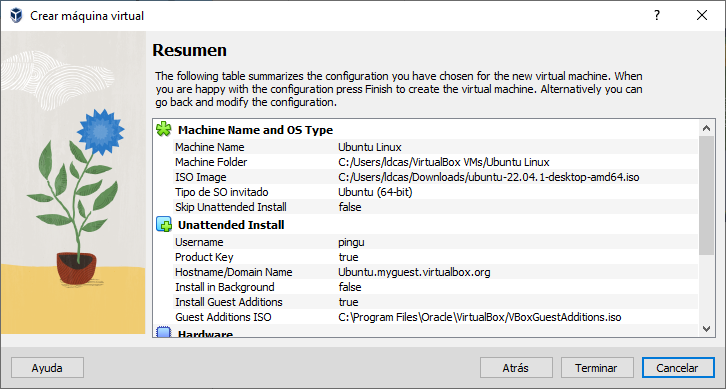

# Instalación de Linux en Máquina Virtual

En éste tutorial instalaremos paso a paso Ubuntu Linux 22.04.1 LTS en una máquina virtual de Oracle VM VirtualBox 7.0.6 para Windows.

Antes de empezar, instala [VirtualBox](https://www.virtualbox.org/) y descarga la [ISO de Ubuntu Desktop](https://ubuntu.com/download/desktop).

## Requisitos
- Procesador de al menos 2 cores/núcleos y frecuencia de 2GHz (o superior)
- 4GB de memoria RAM (o superior)
- 25GB de espacio libre en el disco (o superior)

## 1. Creación de la máquina virtual

1. Abre VirtualBox y dale a `Nueva` para crear una nueva VM
    
2. Rellena los siguientes campos del instalador:
    - Nombre: El nombre de tu máquina.
    - Folder: La carpeta donde se va a guardar la máquina.  
    Puedes dejar la ruta por defecto o elegir otra carpeta, por ejemplo, en otro disco con más espacio.
    - ISO Image: La ruta a la imagen `.iso` de Ubuntu (el archivo que te has descargado)
    - No hagas check Haz _check_ en la cajita de `Skip  Unattended Installation`

    

    Y haz click en `Next`.

3. Configura el usuario, nombre de la máquina (hostname) y contraseña.
    

    Y haz click en `Next`.

4. Ahora toca configurar los recursos dedicados a la máquina Virtual.  
Éstos recursos de tu ordenador serán usados por la VM en vez del SO principal (Windows) de tu ordenador. Lo recomendable es siempre dejar recursos para tu SO principal.
    - Memoria base: La cantidad de memoria RAM dedicada a la VM.  
    Lo recomendable son 4096MB (4GB), pero depende de la cantidad de memoria con la que cuente tu ordenador.  
    Más memoria implica que puedes hacer más cosas en la VM.
    - Processors: El número de núcleos de la CPU dedicados a la VM.  
    Lo mínimo recomendable son 2 núcleos.

    

    Y haz click en `Next`.

5. Finalmente, configura el espacio en disco.  
Recomiendo usar un disco virtual (Virtual Hard Disk), que se irá expandiendo y ocupando más tamaño conforme lo necesites.  

    Recomiendo empezar con 10GB para una instalación básica.

    

    Y haz click en `Next`.

6. Comprueba los ajustes y haz click en `Terminar`.
    

7. VirtualBox te instalará automáticamente todo, no tienes que tocar nada hasta que termine.  

    Nota: El panel lateral de marras se quita clickando en el icono azul arriba a la izquierda.

    

8. Reinicia la máquina al terminar la instalación.

## Notas extra
Recuerda que siempre puedes escapar de la captura del teclado y ratón por parte de la VM usando la "Tecla de anfitrión", por defecto "CTRL derecha".

